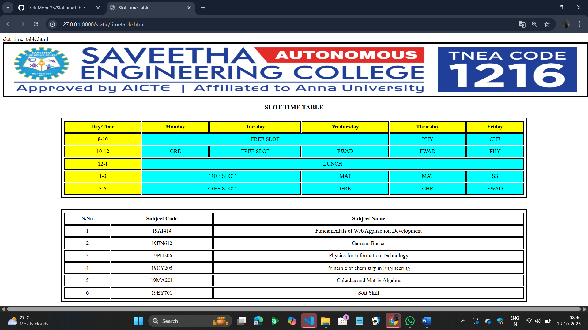

# Ex03 Time Table
## Date:14/10/25

## AIM
To write a html webpage page to display your slot timetable.

## ALGORITHM
### STEP 1
Create a Django-admin Interface.

### STEP 2
Create a static folder and inert HTML code.

### STEP 3
Create a simple table using ```<table>``` tag in html.

### STEP 4
Add header row using ```<th>``` tag.

### STEP 5
Add your timetable using ```<td>``` tag.

### STEP 6
Execute the program using runserver command.

## PROGRAM
```
slot_time_table.html
<!DOCTYPE html>
<html lang="en">
<head>
    <meta charset="UTF-8">
    <meta name="viewport" content="width=device-width, initial-scale=1.0">
    <title>Slot Time Table</title>
    <style>
        table, th, td
        {
            border: 2px solid;
            text-align: center;
            padding: 6px;
        }
        table{
            width: 80%;
            margin-left: 10%;
        }
        h3{
            text-align: center;
        }
        #time{
            background-color: yellow;
        }
        #time_table{
            background-color: aqua;
        }
        img{
            border: 5px solid black;
        }
    </style>
</head>
<body>
    
    <h3>SLOT TIME TABLE</h3>
    <table>
        <thead>
            <tr style="background-color: yellow;">
                <th>Day/Time</th>
                <th>Monday</th>
                <th>Tuesday</th>
                <th>Wednesday</th>
                <th>Thrusday</th>
                <th>Friday</th>
            </tr>
        </thead>
        <tbody id="time_table">
            <tr>
                <td id="time">8-10</td>
                <td colspan="3">FREE SLOT</td>
                <td>PHY</td>
                <td>CHE</td>
            </tr>
            <tr>
                <td id="time">10-12</td>
                <td>GRE</td>
                <td>FREE SLOT</td>
                <td>FWAD</td>
                <td>FWAD</td>
                <td>PHY</td>
            </tr>
            <tr>
                <td id="time">12-1</td>
                <td colspan="5">LUNCH</td>
            </tr>
            <tr>
                <td id="time">1-3</td>
                <td colspan="2">FREE SLOT</td>
                <td>MAT</td>
                <td>MAT</td>
                <td>SS</td>
            </tr>
            <tr>
                <td id="time">3-5</td>
                <td colspan="2">FREE SLOT</td>
                <td>GRE</td>
                <td>CHE</td>
                <td>FWAD</td>
            </tr>
        </tbody>
    </table>

    <div style="padding-top: 2%;">
        <table>
        <thead>
            <tr>
                <th>S.No</th>
                <th>Subject Code</th>
                <th>Subject Name</th>
            </tr>
        </thead>
        <tbody>
            <tr>
                <td>1</td>
                <td>19AI414</td>
                <td>Fundamentals of Web Appliaction Development</td>
            </tr>
            <tr>
                <td>2</td>
                <td>19EN612</td>
                <td>German Basics</td>
            </tr>
            <tr>
                <td>3</td>
                <td>19PH206</td>
                <td>Physics for Information Technology</td>
            </tr>
            <tr>
                <td>4</td>
                <td>19CY205</td>
                <td>Principle of chemistry in Engineering</td>
            </tr>
            <tr>
                <td>5</td>
                <td>19MA201</td>
                <td>Calculas and Matrix Algebra</td>
            </tr>
            <tr>
                <td>6</td>
                <td>19EY701</td>
                <td>Soft Skill  </td>
            </tr>
        </tbody>
        </table>
    </div>
</body>
</html>


```

## OUTPUT



INCLUDE YOUR OUTPUT IMAGE

## RESULT
The program for creating slot timetable using basic HTML tags is executed successfully.
